# 🏠 Hommy Domain Model - DDD (Domain-Driven Design)

> **Nguồn dữ liệu:** Trích xuất từ `thue_tro.sql` (MySQL 8.0.30)  
> **Ngày cập nhật:** 2025-05-29  
> **Tác giả:** GitHub Copilot  
> **Phiên bản:** 2.0

---

## 📊 Tổng quan Hệ thống

**Hommy** là nền tảng cho thuê phòng trọ theo mô hình **Managed Marketplace**, nơi:
- **Khách hàng** tìm kiếm và thuê phòng
- **Chủ dự án** đăng tin và quản lý bất động sản
- **Nhân viên Bán hàng** hỗ trợ khách hàng qua cuộc hẹn
- **Nhân viên Điều hành** duyệt tin, quản lý nền tảng
- **Quản trị viên Hệ thống** cấu hình và bảo trì

---

## 🎯 DDD Domain Model - Mermaid Class Diagram

```mermaid
---
config:
  theme: base
  themeVariables:
    primaryColor: '#F6C79E'
    primaryBorderColor: '#C97C32'
    primaryTextColor: '#111111'
    lineColor: '#666666'
    fontFamily: ''
  layout: elk
---
classDiagram
direction TB
    class NguoiDung {
	    +NguoiDungID: int [PK]
	    +VaiTroHoatDongID: int [FK]
	    +TrangThai: TrangThaiTaiKhoan
	    +TrangThaiXacMinh: TrangThaiKYC
	    +NgaySinh: date
	    +DiaChi: DiaChi
	    +NgayCapCCCD: date
	    +TaoLuc: datetime
	    +CapNhatLuc: datetime
	    +TenDayDu: varchar(255)
	    +Email: varchar(255) [UK]
	    +SoDienThoai: varchar(20)
	    +MatKhauHash: varchar(255)
	    +SoCCCD: varchar(12)
	    +AnhCCCDMatTruoc: varchar(255)
	    +AnhCCCDMatSau: varchar(255)
	    +AnhSelfie: varchar(255)
    }

    class VaiTro {
	    +VaiTroID: int [PK]
	    +MoTa: text
	    +TenVaiTro: varchar(100)
    }

    class Quyen {
	    +QuyenID: int [PK]
	    +MoTa: text
	    +MaQuyen: varchar(100)
    }

    class VaiTro_Quyen {
	    +VaiTroID: int [PK, FK]
	    +QuyenID: int [PK, FK]
    }

    class KYC_Verification {
	    +KYCVerificationID: bigint [PK]
	    +NguoiDungID: int [FK]
	    +NgaySinh: date
	    +DiaChi: DiaChi
	    +NgayCapCCCD: date
	    +TrangThai: TrangThaiKYCResult
	    +LyDoThatBai: text
	    +TaoLuc: datetime
	    +SoCCCD: varchar(12)
	    +TenDayDu: varchar(255)
	    +FaceSimilarity: decimal(5,4)
	    +AnhCCCDMatTruoc: varchar(255)
	    +AnhCCCDMatSau: varchar(255)
	    +AnhSelfie: varchar(255)
    }

    class HoSoNhanVien {
	    +HoSoID: int [PK]
	    +NguoiDungID: int [FK, UK]
	    +QuanLyID: int [FK, nullable]
	    +KhuVucChinhID: int [FK, nullable]
	    +MaNhanVien: varchar(50)
	    +TyLeHoaHong: decimal(5,2)
    }

    class LichLamViec {
	    +LichID: int [PK]
	    +NhanVienBanHangID: int [FK]
	    +ThoiGian: KhoangThoiGian
    }

    class DuAn {
	    +DuAnID: int [PK]
	    +DiaChi: DiaChi
	    +ChuDuAnID: int [FK]
	    +ChinhSachCocID: int [FK, nullable]
	    +BangHoaHong: text [JSON]
	    +SoThangCocToiThieu: int
	    +PhuongThucVao: text
	    +TrangThai: TrangThaiDuAn
	    +LyDoNgungHoatDong: text
	    +NguoiNgungHoatDongID: int [FK]
	    +NgungHoatDongLuc: datetime
	    +YeuCauMoLai: TrangThaiYeuCauMoLai
	    +NoiDungGiaiTrinh: text
	    +ThoiGianGuiYeuCau: datetime
	    +NguoiXuLyYeuCauID: int [FK]
	    +ThoiGianXuLyYeuCau: datetime
	    +LyDoTuChoiMoLai: text
	    +TrangThaiDuyetHoaHong: TrangThaiDuyetHoaHong
	    +NguoiDuyetHoaHongID: int [FK]
	    +ThoiGianDuyetHoaHong: datetime
	    +LyDoTuChoiHoaHong: text
	    +TaoLuc: datetime
	    +CapNhatLuc: datetime
	    +TenDuAn: varchar(255)
	    +YeuCauPheDuyetChu: tinyint(1)
    }

    class Phong {
	    +PhongID: int [PK]
	    +DuAnID: int [FK]
	    +TrangThai: TrangThaiPhong
	    +ThongTinGia: ThongTinGia
	    +MoTaPhong: text
	    +TaoLuc: datetime
	    +CapNhatLuc: datetime
	    +TenPhong: varchar(100)
	    +DienTichChuan: decimal(5,2)
	    +HinhAnhPhong: varchar(500)
    }

    class KhuVuc {
	    +KhuVucID: int [PK]
	    +ParentKhuVucID: int [FK, nullable]
	    +ViTri: DiaChi
	    +TenKhuVuc: varchar(255)
    }

    class ChinhSachCoc {
	    +ChinhSachCocID: int [PK]
	    +ChuDuAnID: int [FK, nullable]
	    +MoTa: text
	    +TTL_CocGiuCho_Gio: int
	    +TyLePhat_CocGiuCho: tinyint
	    +QuyTacGiaiToa: QuyTacGiaiToa
	    +SoNgayGiaiToa: int
	    +TaoLuc: datetime
	    +CapNhatLuc: datetime
	    +TenChinhSach: varchar(255)
	    +ChoPhepCocGiuCho: tinyint(1)
	    +ChoPhepCocAnNinh: tinyint(1)
	    +SoTienCocAnNinhMacDinh: decimal(15,2)
	    +HieuLuc: tinyint(1)
    }

    class TinDang {
	    +TinDangID: int [PK]
	    +DuAnID: int [FK]
	    +KhuVucID: int [FK]
	    +ChinhSachCocID: int [FK]
	    +URL: text [JSON array]
	    +MoTa: text
	    +TienIch: text [JSON array]
	    +ThongTinGia: ThongTinGia
	    +TrangThai: TrangThaiTinDang
	    +LyDoTuChoi: text
	    +DuyetBoiNhanVienID: int [FK]
	    +TaoLuc: datetime
	    +CapNhatLuc: datetime
	    +DuyetLuc: datetime
	    +TieuDe: varchar(255)
    }

    class Phong_TinDang {
	    +PhongTinDangID: int [PK]
	    +PhongID: int [FK]
	    +TinDangID: int [FK]
	    +ThongTinGia: ThongTinGia
	    +MoTaTinDang: text
	    +ThuTuHienThi: int
	    +TaoLuc: datetime
	    +DienTichTinDang: decimal(5,2)
	    +HinhAnhTinDang: varchar(500)
    }

    class ThongKeTinDang {
	    +ThongKeID: int [PK]
	    +TinDangID: int [FK]
	    +Ky: date
	    +SoLuotXem: int
	    +SoYeuThich: int
	    +SoCuocHen: int
	    +SoHopDong: int
	    +CapNhatLuc: datetime
    }

    class YeuThich {
	    +NguoiDungID: int [PK, FK]
	    +TinDangID: int [PK, FK]
    }

    class CuocHen {
	    +CuocHenID: int [PK]
	    +KhachHangID: int [FK]
	    +NhanVienBanHangID: int [FK]
	    +ChuDuAnID: int [FK]
	    +PhongID: int [FK]
	    +TinDangID: int [FK]
	    +ThoiGianHen: KhoangThoiGian
	    +TrangThai: TrangThaiCuocHen
	    +PheDuyetChuDuAn: TrangThaiPheDuyet
	    +LyDoTuChoi: text
	    +PhuongThucVao: text
	    +ThoiGianPheDuyet: datetime
	    +SoLanDoiLich: int
	    +GhiChuKetQua: text [JSON]
	    +GhiChu: text
	    +TaoLuc: datetime
	    +CapNhatLuc: datetime
    }

    class HopDong {
	    +HopDongID: int [PK]
	    +TinDangID: int [FK]
	    +PhongID: int [FK]
	    +DuAnID: int [FK]
	    +KhachHangID: int [FK]
	    +ThoiHanThue: KhoangThoiGian
	    +ThongTinGia: ThongTinGia
	    +TrangThai: TrangThaiHopDong
	    +TaoLuc: datetime
	    +CapNhatLuc: datetime
    }

    class BienBanBanGiao {
	    +BienBanBanGiaoID: bigint [PK]
	    +HopDongID: int [FK]
	    +TinDangID: int [FK]
	    +PhongID: int [FK]
	    +TrangThai: TrangThaiBienBan
	    +ChiSoDien: int
	    +ChiSoNuoc: int
	    +HienTrangJSON: longtext [JSON]
	    +TaoLuc: datetime
	    +CapNhatLuc: datetime
	    +ChuKySo: varchar(255)
    }

    class Coc {
	    +CocID: bigint [PK]
	    +GiaoDichID: int [FK]
	    +TinDangID: int [FK]
	    +PhongID: int [FK]
	    +Loai: LoaiCoc
	    +ThoiHanHieuLuc: KhoangThoiGian
	    +TrangThai: TrangThaiCoc
	    +BienBanBanGiaoID: bigint [FK]
	    +HopDongID: int [FK]
	    +GhiChu: text
	    +ChinhSachCocID: int [FK]
	    +QuyTacGiaiToaSnapshot: QuyTacGiaiToa
	    +TyLePhatCocGiuChoSnapshot: tinyint
	    +SoNgayGiaiToaSnapshot: int
	    +LyDoGiaiToa: text
	    +LyDoKhauTru: text
	    +TaoLuc: datetime
	    +CapNhatLuc: datetime
	    +SoTien: decimal(15,2)
    }

    class GiaoDich {
	    +GiaoDichID: int [PK]
	    +ViID: int [FK]
	    +Loai: LoaiGiaoDich
	    +TrangThai: TrangThaiGiaoDich
	    +TinDangLienQuanID: int [FK]
	    +GiaoDichThamChieuID: int [FK]
	    +ThoiGian: datetime
	    +KenhThanhToan: KenhThanhToan
	    +ChungTuDinhKemURL: text
	    +SoTien: decimal(15,2)
	    +KhoaDinhDanh: char(36) [UK]
	    +MaGiaoDichNCC: varchar(128)
	    +HoaDonDT_ID: varchar(64)
    }

    class Vi {
	    +ViID: int [PK]
	    +NguoiDungID: int [FK, UK]
	    +SoDu: decimal(15,2)
    }

    class ButToanSoCai {
	    +ButToanID: bigint [PK]
	    +GiaoDichID: int [FK]
	    +ViID: int [FK]
	    +LoaiButToan: LoaiButToan
	    +SoTien: decimal(15,2)
	    +ThoiGian: datetime(3)
    }

    class LichSuVi {
	    +id: bigint [PK]
	    +user_id: bigint [FK]
	    +trang_thai: TrangThaiLichSuVi
	    +thoi_gian: timestamp
	    +LoaiGiaoDich: text
	    +ma_giao_dich: varchar(50)
	    +so_tien: decimal(18,2)
    }

    class YeuCauRutTien {
	    +YeuCauID: int [PK]
	    +NguoiDungID: int [FK]
	    +TrangThai: TrangThaiYeuCauRutTien
	    +GhiChu: text
	    +TaoLuc: datetime
	    +CapNhatLuc: datetime
	    +SoTien: decimal(15,2)
	    +NganHang: varchar(100)
	    +SoTaiKhoan: varchar(50)
	    +TenChuTaiKhoan: varchar(100)
    }

    class CuocHoiThoai {
	    +CuocHoiThoaiID: int [PK]
	    +NguCanhID: int
	    +NguCanhLoai: NguCanhLoai
	    +ThoiDiemTinNhanCuoi: datetime
	    +TaoLuc: datetime
	    +CapNhatLuc: datetime
	    +TieuDe: varchar(255)
	    +DangHoatDong: tinyint(1)
    }

    class TinNhan {
	    +TinNhanID: int [PK]
	    +CuocHoiThoaiID: int [FK]
	    +NguoiGuiID: int [FK]
	    +NoiDung: text
	    +ThoiGian: datetime
	    +DaXoa: tinyint(1)
    }

    class ThanhVienCuocHoiThoai {
	    +CuocHoiThoaiID: int [PK, FK]
	    +NguoiDungID: int [PK, FK]
	    +ThamGiaLuc: datetime
	    +TinNhanCuoiDocLuc: datetime
    }

    class ThongBao {
	    +ThongBaoID: int [PK]
	    +NguoiNhanID: int [FK]
	    +NoiDung: text
	    +Payload: longtext [JSON]
	    +SoLanThu: int
	    +TaoLuc: datetime
	    +GuiLuc: datetime
	    +Kenh: varchar(50)
	    +TieuDe: varchar(255)
	    +TrangThai: varchar(50)
    }

    class NhatKyHeThong {
	    +NhatKyID: bigint [PK]
	    +NguoiDungID: int [FK]
	    +GiaTriTruoc: text [JSON]
	    +GiaTriSau: text [JSON]
	    +TrinhDuyet: text
	    +HanhDong: varchar(100)
	    +DoiTuong: varchar(100)
	    +DoiTuongID: varchar(255)
	    +DiaChiIP: varchar(45)
	    +ThoiGian: datetime(3)
	    +ChuKy: varchar(255)
    }

	<<AggregateRoot>> NguoiDung
	<<Entity>> VaiTro
	<<Entity>> Quyen
	<<JoinTable>> VaiTro_Quyen
	<<Entity>> KYC_Verification
	<<Entity>> HoSoNhanVien
	<<Entity>> LichLamViec
	<<AggregateRoot>> DuAn
	<<Entity>> Phong
	<<Entity>> KhuVuc
	<<Entity>> ChinhSachCoc
	<<AggregateRoot>> TinDang
	<<JoinTable>> Phong_TinDang
	<<Entity>> ThongKeTinDang
	<<JoinTable>> YeuThich
	<<Entity>> CuocHen
	<<AggregateRoot>> HopDong
	<<Entity>> BienBanBanGiao
	<<Entity>> Coc
	<<AggregateRoot>> GiaoDich
	<<AggregateRoot>> Vi
	<<Entity>> ButToanSoCai
	<<Entity>> LichSuVi
	<<Entity>> YeuCauRutTien
	<<AggregateRoot>> CuocHoiThoai
	<<Entity>> TinNhan
	<<JoinTable>> ThanhVienCuocHoiThoai
	<<AggregateRoot>> ThongBao
	<<AggregateRoot>> NhatKyHeThong

    NguoiDung "1" -- "0..1" VaiTro : co_vai_tro >
    VaiTro "1" -- "*" VaiTro_Quyen : co_quyen >
    Quyen "1" -- "*" VaiTro_Quyen : thuoc_vai_tro >
    NguoiDung "1" -- "*" KYC_Verification : xac_minh_danh_tinh >
    NguoiDung "1" -- "0..1" HoSoNhanVien : la_nhan_vien >
    HoSoNhanVien "1" -- "*" LichLamViec : lam_viec_theo >
    NguoiDung "1" -- "*" DuAn : so_huu_du_an >
    DuAn "1" -- "*" Phong : bao_gom >
    DuAn "1" -- "0..1" ChinhSachCoc : ap_dung_chinh_sach >
    DuAn "*" -- "1" KhuVuc : nam_trong_khu_vuc >
    KhuVuc "0..1" -- "*" KhuVuc : phan_cap_dia_ly >
    DuAn "1" -- "*" TinDang : dang_tin >
    TinDang "*" -- "*" Phong : quang_cao_phong >
    Phong_TinDang -- TinDang
    Phong_TinDang -- Phong
    TinDang "1" -- "*" ThongKeTinDang : co_thong_ke >
    NguoiDung "*" -- "*" TinDang : yeu_thich >
    YeuThich -- NguoiDung
    YeuThich -- TinDang
    NguoiDung "1" -- "*" CuocHen : dat_hen_xem_phong >
    NguoiDung "1" -- "*" CuocHen : phu_trach_cuoc_hen >
    TinDang "1" -- "*" CuocHen : co_cuoc_hen >
    Phong "1" -- "*" CuocHen : xem_phong >
    NguoiDung "1" -- "*" HopDong : ky_hop_dong >
    Phong "1" -- "*" HopDong : cho_thue_phong >
    TinDang "1" -- "*" HopDong : tu_tin_dang >
    HopDong "1" -- "*" BienBanBanGiao : ban_giao >
    GiaoDich "1" -- "0..1" Coc : tao_coc >
    TinDang "1" -- "*" Coc : dat_coc_cho >
    Phong "1" -- "*" Coc : coc_phong >
    HopDong "1" -- "*" Coc : coc_hop_dong >
    BienBanBanGiao "1" -- "*" Coc : doi_tru_khi_ban_giao >
    NguoiDung "1" -- "0..1" Vi : co_vi >
    Vi "1" -- "*" GiaoDich : thuc_hien_giao_dich >
    GiaoDich "1" -- "*" ButToanSoCai : ghi_so_cai >
    Vi "1" -- "*" ButToanSoCai : anh_huong_vi >
    NguoiDung "1" -- "*" LichSuVi : lich_su_vi >
    NguoiDung "1" -- "*" YeuCauRutTien : yeu_cau_rut_tien >
    CuocHoiThoai "1" -- "*" TinNhan : chua_tin_nhan >
    NguoiDung "1" -- "*" TinNhan : gui_tin_nhan >
    NguoiDung "*" -- "*" CuocHoiThoai : tham_gia_hoi_thoai >
    ThanhVienCuocHoiThoai -- NguoiDung
    ThanhVienCuocHoiThoai -- CuocHoiThoai
    NguoiDung "1" -- "*" ThongBao : nhan_thong_bao >
    NguoiDung "1" -- "*" NhatKyHeThong : thuc_hien_hanh_dong >
```



---

## 📦 Enumerations (Value Objects)

### IAM Context
```typescript
enum TrangThaiTaiKhoan {
    HoatDong = "HoatDong",
    TamKhoa = "TamKhoa",
    VoHieuHoa = "VoHieuHoa",
    XoaMem = "XoaMem"
}

enum TrangThaiKYC {
    ChuaXacMinh = "ChuaXacMinh",
    ChoDuyet = "ChoDuyet",
    DaXacMinh = "DaXacMinh",
    TuChoi = "TuChoi"
}

enum TrangThaiKYCResult {
    ThanhCong = "ThanhCong",
    ThatBai = "ThatBai",
    CanXemLai = "CanXemLai"
}
```

### Property Context
```typescript
enum TrangThaiDuAn {
    HoatDong = "HoatDong",
    NgungHoatDong = "NgungHoatDong",
    LuuTru = "LuuTru"
}

enum TrangThaiPhong {
    Trong = "Trong",
    GiuCho = "GiuCho",
    DaThue = "DaThue",
    DonDep = "DonDep"
}

enum TrangThaiYeuCauMoLai {
    ChuaGui = "ChuaGui",
    DangXuLy = "DangXuLy",
    ChapNhan = "ChapNhan",
    TuChoi = "TuChoi"
}

enum TrangThaiDuyetHoaHong {
    ChoDuyet = "ChoDuyet",
    DaDuyet = "DaDuyet",
    TuChoi = "TuChoi"
}

enum QuyTacGiaiToa {
    BanGiao = "BanGiao",
    TheoNgay = "TheoNgay",
    Khac = "Khac"
}
```

### Listing Context
```typescript
enum TrangThaiTinDang {
    Nhap = "Nhap",
    ChoDuyet = "ChoDuyet",
    DaDuyet = "DaDuyet",
    DaDang = "DaDang",
    TamNgung = "TamNgung",
    TuChoi = "TuChoi",
    LuuTru = "LuuTru"
}
```

### Sales Context
```typescript
enum TrangThaiCuocHen {
    DaYeuCau = "DaYeuCau",
    ChoXacNhan = "ChoXacNhan",
    DaXacNhan = "DaXacNhan",
    DaDoiLich = "DaDoiLich",
    HuyBoiKhach = "HuyBoiKhach",
    HuyBoiHeThong = "HuyBoiHeThong",
    KhachKhongDen = "KhachKhongDen",
    HoanThanh = "HoanThanh"
}

enum TrangThaiPheDuyet {
    ChoPheDuyet = "ChoPheDuyet",
    DaPheDuyet = "DaPheDuyet",
    TuChoi = "TuChoi"
}
```

### Contract Context
```typescript
enum TrangThaiHopDong {
    Nhap = "Nhap",
    DangHieuLuc = "DangHieuLuc",
    DaKetThuc = "DaKetThuc",
    DaHuy = "DaHuy"
}

enum TrangThaiBienBan {
    ChuaBanGiao = "ChuaBanGiao",
    DangBanGiao = "DangBanGiao",
    DaBanGiao = "DaBanGiao"
}
```

### Deposit Context
```typescript
enum LoaiCoc {
    CocGiuCho = "CocGiuCho",
    CocAnNinh = "CocAnNinh"
}

enum TrangThaiCoc {
    HieuLuc = "HieuLuc",
    HetHan = "HetHan",
    DaGiaiToa = "DaGiaiToa",
    DaDoiTru = "DaDoiTru"
}
```

### Wallet Context
```typescript
enum LoaiGiaoDich {
    NAP_TIEN = "NAP_TIEN",
    COC_GIU_CHO = "COC_GIU_CHO",
    COC_AN_NINH = "COC_AN_NINH",
    THANH_TOAN_KY_DAU = "THANH_TOAN_KY_DAU",
    PHI_NEN_TANG = "PHI_NEN_TANG",
    HOAN_COC_GIU_CHO = "HOAN_COC_GIU_CHO",
    HOAN_COC_AN_NINH = "HOAN_COC_AN_NINH",
    GIAI_TOA_COC_AN_NINH = "GIAI_TOA_COC_AN_NINH",
    RUT_TIEN = "RUT_TIEN"
}

enum TrangThaiGiaoDich {
    KhoiTao = "KhoiTao",
    DaUyQuyen = "DaUyQuyen",
    DaGhiNhan = "DaGhiNhan",
    DaThanhToan = "DaThanhToan",
    DaHoanTien = "DaHoanTien",
    DaDaoNguoc = "DaDaoNguoc"
}

enum LoaiButToan {
    ghi_no = "ghi_no",
    ghi_co = "ghi_co"
}

enum KenhThanhToan {
    CHUYEN_KHOAN = "CHUYEN_KHOAN",
    VI_DIEN_TU = "VI_DIEN_TU",
    TIEN_MAT = "TIEN_MAT"
}

enum TrangThaiLichSuVi {
    THANH_CONG = "THANH_CONG",
    CHO_XU_LY = "CHO_XU_LY"
}

enum TrangThaiYeuCauRutTien {
    ChoXuLy = "ChoXuLy",
    DaDuyet = "DaDuyet",
    TuChoi = "TuChoi"
}
```

### Communication Context
```typescript
enum NguCanhLoai {
    TinDang = "TinDang",
    CuocHen = "CuocHen",
    HopDong = "HopDong",
    HeThong = "HeThong"
}
```

---

## 🔗 Bảng Quan hệ Tên Tiếng Việt (Vietnamese Relationship Names)

| Từ | Đến | Loại | Tên Quan Hệ (Việt) | Cardinality |
|---|---|---|---|---|
| NguoiDung | VaiTro | Association | **co_vai_tro** | 1..0..1 |
| NguoiDung | DuAn | Composition | **so_huu_du_an** | 1..* |
| NguoiDung | Vi | Composition | **co_vi** | 1..0..1 |
| NguoiDung | CuocHen | Association | **dat_hen_xem_phong** | 1..* |
| NguoiDung | HopDong | Association | **ky_hop_dong** | 1..* |
| NguoiDung | KYC_Verification | Composition | **xac_minh_danh_tinh** | 1..* |
| NguoiDung | ThongBao | Association | **nhan_thong_bao** | 1..* |
| NguoiDung | NhatKyHeThong | Association | **thuc_hien_hanh_dong** | 1..* |
| NguoiDung | YeuCauRutTien | Composition | **yeu_cau_rut_tien** | 1..* |
| DuAn | Phong | Composition | **bao_gom** | 1..* |
| DuAn | TinDang | Composition | **dang_tin** | 1..* |
| DuAn | ChinhSachCoc | Association | **ap_dung_chinh_sach** | *..0..1 |
| DuAn | KhuVuc | Association | **nam_trong_khu_vuc** | *..1 |
| TinDang | Phong | Association | **quang_cao_phong** | *..* |
| TinDang | CuocHen | Association | **co_cuoc_hen** | 1..* |
| TinDang | ThongKeTinDang | Composition | **co_thong_ke** | 1..* |
| TinDang | HopDong | Association | **tu_tin_dang** | 1..* |
| TinDang | Coc | Association | **dat_coc_cho** | 1..* |
| Phong | HopDong | Association | **cho_thue_phong** | 1..* |
| Phong | Coc | Association | **coc_phong** | 1..* |
| Phong | CuocHen | Association | **xem_phong** | 1..* |
| HopDong | BienBanBanGiao | Composition | **ban_giao** | 1..* |
| HopDong | Coc | Association | **coc_hop_dong** | 1..* |
| Vi | GiaoDich | Composition | **thuc_hien_giao_dich** | 1..* |
| GiaoDich | ButToanSoCai | Composition | **ghi_so_cai** | 1..* |
| GiaoDich | Coc | Association | **tao_coc** | 1..0..1 |
| BienBanBanGiao | Coc | Association | **doi_tru_khi_ban_giao** | 1..* |
| CuocHoiThoai | TinNhan | Composition | **chua_tin_nhan** | 1..* |
| VaiTro | Quyen | Association | **co_quyen** | *..* |
| HoSoNhanVien | LichLamViec | Composition | **lam_viec_theo** | 1..* |
| KhuVuc | KhuVuc | Self-reference | **phan_cap_dia_ly** | 0..1..* |

---

## 📊 Bounded Contexts Summary

| # | Bounded Context | Aggregate Roots | Entities | Value Objects |
|---|---|---|---|---|
| 1 | **IAM** | NguoiDung | VaiTro, Quyen, KYC_Verification, HoSoNhanVien, LichLamViec | TrangThaiTaiKhoan, TrangThaiKYC |
| 2 | **Property & Inventory** | DuAn | Phong, KhuVuc, ChinhSachCoc | TrangThaiDuAn, TrangThaiPhong, QuyTacGiaiToa |
| 3 | **Listing & Discovery** | TinDang | Phong_TinDang, ThongKeTinDang, YeuThich | TrangThaiTinDang |
| 4 | **Sales & Booking** | CuocHen | - | TrangThaiCuocHen, TrangThaiPheDuyet |
| 5 | **Contract & Handover** | HopDong | MauHopDong, BienBanBanGiao | TrangThaiHopDong, TrangThaiBienBan |
| 6 | **Deposit & Escrow** | Coc | - | LoaiCoc, TrangThaiCoc |
| 7 | **Wallet & Ledger** | Vi, GiaoDich | ButToanSoCai, LichSuVi, YeuCauRutTien, Transactions | LoaiGiaoDich, TrangThaiGiaoDich, LoaiButToan |
| 8 | **Communication** | CuocHoiThoai | TinNhan, ThanhVienCuocHoiThoai | NguCanhLoai |
| 9 | **Notification** | ThongBao | - | - |
| 10 | **Audit & Compliance** | NhatKyHeThong | - | - |
| 11 | **System Content** | - | NoiDungHeThong | - |

---

## 🏗️ Database Triggers & Business Rules

### 1. Ledger Append-Only (buttoansocai)
```sql
-- Không cho phép UPDATE hoặc DELETE bút toán sổ cái
TRIGGER trg_buttoan_no_delete BEFORE DELETE ON buttoansocai
TRIGGER trg_buttoan_no_update BEFORE UPDATE ON buttoansocai
```

### 2. One Active Deposit Per Room (coc)
```sql
-- Một phòng chỉ được có tối đa 1 cọc hiệu lực
TRIGGER trg_coc_one_active_per_room_ins BEFORE INSERT ON coc
TRIGGER trg_coc_one_active_per_room_upd BEFORE UPDATE ON coc
```

### 3. Validate Ledger Balance (giaodich)
```sql
-- Kiểm tra tổng nợ = tổng có khi giao dịch chuyển sang DaGhiNhan
TRIGGER trg_validate_ledger_on_giaodich AFTER UPDATE ON giaodich
```

### 4. KYC Required for Publishing (tindang)
```sql
-- Chủ dự án phải đạt KYC (DaXacMinh) mới được đăng tin
TRIGGER trg_tindang_pre_publish BEFORE UPDATE ON tindang
```

### 5. One Active Handover Per Room (bienbanbangiao)
```sql
-- Một phòng chỉ được có tối đa 1 biên bản bàn giao đang xử lý
TRIGGER trg_before_insert_bienbanbangiao_check_active BEFORE INSERT ON bienbanbangiao
```

### 6. Deposit Policy Validation (chinhsachcoc, coc)
```sql
-- Tỷ lệ phạt cọc giữ chỗ phải từ 0-100%
TRIGGER trg_chk_tyle_policy_ins/upd BEFORE INSERT/UPDATE ON chinhsachcoc
TRIGGER trg_chk_tyle_snapshot_ins/upd BEFORE INSERT/UPDATE ON coc
```

---

## 🔑 Key Indexes & Performance

### Critical Indexes
- `idx_coc_phong_trangthai` - Tìm cọc hiệu lực theo phòng
- `idx_coc_loai_trangthai` - Tìm theo loại cọc và trạng thái
- `idx_coc_taoluc_trangthai` - Báo cáo cọc theo thời gian
- `idx_cuochen_khachhang` - Danh sách cuộc hẹn của khách
- `idx_bbbg_phong` - Biên bản bàn giao theo phòng

---

## 📚 References

- **Source SQL:** `thue_tro.sql` (MySQL 8.0.30)
- **Use Cases:** `docs/use-cases-v1.2.md`
- **Design System:** `docs/DESIGN_SYSTEM_COLOR_PALETTES.md`
- **API Routes:** `docs/chu-du-an-routes-implementation.md`
